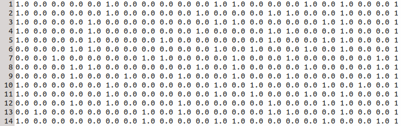
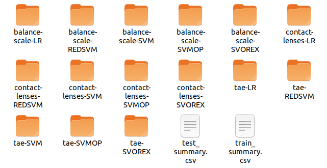
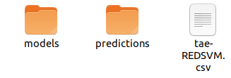
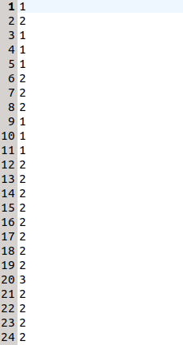
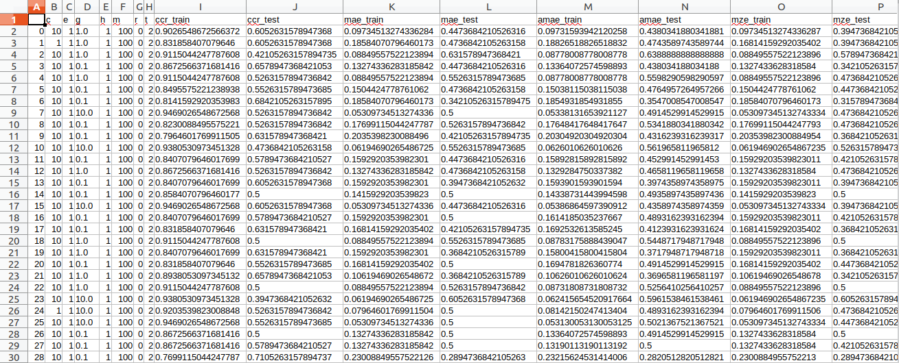
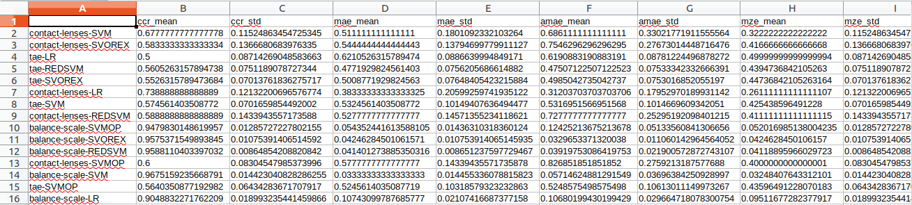

```python
import os

#Cambia el directorio a la raíz del repositorio si es necesario
if(os.path.exists("spanish_user_manual.ipynb")):
    jupyter_path = os.getcwd()
    orca_path = os.path.abspath(os.path.join(jupyter_path, os.pardir))

    os.chdir(orca_path)
```

1. [¿Qué es ORCA-Python?](#¿Qué-es-ORCA-Python?)
2. [Instalación](#Instalación)
    1. [Requisitos para la Instalación](#Requisitos-para-la-Instalación)
    2. [Descarga de ORCA-Python](#Descarga-de-ORCA-Python)
    3. [Compilación de Algoritmos](#Compilación-de-Algoritmos)
    4. [Probando la Instalación](#Probando-la-Instalación)
3. [Desinstalación](#Desinstalación)
4. [¿Cómo utilizar ORCA-Python?](#¿Cómo-utilizar-ORCA-Python?)
    1. [Archivos de configuración](#Archivos-de-configuración)
        1. [general-conf](#general-conf)
        2. [configurations](#configurations)
    2. [Parámetros de los Nuevos Algoritmos](#Parámetros-de-los-Nuevos-Algoritmos)
    3. [Formato de las Bases de Datos](#Formato-de-las-Bases-de-Datos)
    4. [Ejecutando un Experimento](#Ejecutando-un-Experimento)
    5. [Formato de los Resultados](#Formato-de-los-Resultados)
5. [Referencias](#Referencias)

# ¿Qué es ORCA-Python?

ORCA-Python [1] es un *framework* escrito en Python [2], completamente integrado con los módulos `scikit-learn` [3] y `sacred` [4], cuyo objetivo es el de automatizar la ejecución de experimentos de *machine learning* utilizando ficheros de configuración fáciles de entender.

Este *framework* es compatible con cualquier algoritmo que se encuentre implementado en `scikit-learn` o bien creado por el usuario siempre que siga las reglas de compatibilidad con dicha librería [5].

# Instalación
ORCA-Python [1] se ha desarrollado y probado en GNU/Linux utilizando Python 2 y Python 3 [2].

## Requisitos para la Instalación
La correcta ejecución de *framework* requiere de la instalación de las siguientes dependencias de Python:

- `numpy` [6] (probado con la versión 1.18.1)
- `pandas` [7] (probado con la versión 1.0.1)
- `sacred` [4] (probado con la versión 0.8.1)
- `scikit-learn` [3] (probado con la versión 0.22.1)
- `scipy` [8] (probado con la versión 1.4.1)

Para la instalación de todas las dependencias se incluye el archivo `requirements.txt`, que facilitará el proceso utilizando el gestor de paquetes `pip` [9]. 

Al utilizar el siguiente comando se instalarán todas las dependencias. Si se quiere ejecutar en una consola fuera de este cuaderno Jupyter se debe eliminar la exclamación del principio.


```python
!pip install -r requirements.txt
```

    Collecting numpy
      Using cached numpy-1.18.4-cp37-cp37m-manylinux1_x86_64.whl (20.2 MB)
    Collecting pandas
      Downloading pandas-1.0.4-cp37-cp37m-manylinux1_x86_64.whl (10.1 MB)
         |████████████████████████████████| 10.1 MB 1.7 MB/s eta 0:00:01    |██████████████████▋             | 5.9 MB 1.7 MB/s eta 0:00:03     |█████████████████████████▍      | 8.0 MB 1.7 MB/s eta 0:00:02
    [?25hProcessing /home/anthares101/.cache/pip/wheels/3c/ac/e1/2f746c47edc95a1cf43119706c787efd9c307a8b3d4a649308/sacred-0.8.1-py2.py3-none-any.whl
    Collecting scikit-learn
      Downloading scikit_learn-0.23.1-cp37-cp37m-manylinux1_x86_64.whl (6.8 MB)
         |████████████████████████████████| 6.8 MB 14.9 MB/s eta 0:00:01
    [?25hCollecting scipy
      Using cached scipy-1.4.1-cp37-cp37m-manylinux1_x86_64.whl (26.1 MB)
    Requirement already satisfied: pytz>=2017.2 in ./env/lib/python3.7/site-packages (from pandas->-r requirements.txt (line 2)) (2019.3)
    Requirement already satisfied: python-dateutil>=2.6.1 in ./env/lib/python3.7/site-packages (from pandas->-r requirements.txt (line 2)) (2.8.1)
    Requirement already satisfied: wrapt<2.0,>=1.0 in ./env/lib/python3.7/site-packages (from sacred->-r requirements.txt (line 3)) (1.11.2)
    Requirement already satisfied: py-cpuinfo>=4.0 in ./env/lib/python3.7/site-packages (from sacred->-r requirements.txt (line 3)) (5.0.0)
    Requirement already satisfied: munch<3.0,>=2.0.2 in ./env/lib/python3.7/site-packages (from sacred->-r requirements.txt (line 3)) (2.5.0)
    Requirement already satisfied: jsonpickle<2.0,>=1.2 in ./env/lib/python3.7/site-packages (from sacred->-r requirements.txt (line 3)) (1.3)
    Requirement already satisfied: GitPython in ./env/lib/python3.7/site-packages (from sacred->-r requirements.txt (line 3)) (3.1.0)
    Requirement already satisfied: colorama>=0.4 in ./env/lib/python3.7/site-packages (from sacred->-r requirements.txt (line 3)) (0.4.3)
    Requirement already satisfied: packaging>=18.0 in ./env/lib/python3.7/site-packages (from sacred->-r requirements.txt (line 3)) (20.3)
    Requirement already satisfied: docopt<1.0,>=0.3 in ./env/lib/python3.7/site-packages (from sacred->-r requirements.txt (line 3)) (0.6.2)
    Requirement already satisfied: joblib>=0.11 in ./env/lib/python3.7/site-packages (from scikit-learn->-r requirements.txt (line 4)) (0.15.1)
    Collecting threadpoolctl>=2.0.0
      Downloading threadpoolctl-2.1.0-py3-none-any.whl (12 kB)
    Requirement already satisfied: six>=1.5 in ./env/lib/python3.7/site-packages (from python-dateutil>=2.6.1->pandas->-r requirements.txt (line 2)) (1.14.0)
    Requirement already satisfied: gitdb<5,>=4.0.1 in ./env/lib/python3.7/site-packages (from GitPython->sacred->-r requirements.txt (line 3)) (4.0.2)
    Requirement already satisfied: pyparsing>=2.0.2 in ./env/lib/python3.7/site-packages (from packaging>=18.0->sacred->-r requirements.txt (line 3)) (2.4.6)
    Requirement already satisfied: smmap<4,>=3.0.1 in ./env/lib/python3.7/site-packages (from gitdb<5,>=4.0.1->GitPython->sacred->-r requirements.txt (line 3)) (3.0.1)
    Installing collected packages: numpy, pandas, sacred, scipy, threadpoolctl, scikit-learn
    Successfully installed numpy-1.18.4 pandas-1.0.4 sacred-0.8.1 scikit-learn-0.23.1 scipy-1.4.1 threadpoolctl-2.1.0


## Compilación de Algoritmos
Aunque es cierto que ORCA-Python está escrito en Python y no necesita ninguna compilación, algunos algoritmos como REDSVM [10, 11, 12] y SVOREX [12, 13, 14] se encuentran escritos en C++ [15] y C [16] respectivamente. Por ello, antes de empezar a utilizar el *framework*, se debe ejecutar el comando `$ make` en la raíz del repositorio descargado para que se compilen todos los algoritmos que lo necesiten. Al ser un cuarderno de Jupyter a los comandos de consola como `make` se le añade la exclamación.


```python
!make
```

    make -e -C classifiers/libsvmRank/python
    make[1]: se entra en el directorio '/home/anthares101/Proyectos/orca-python/classifiers/libsvmRank/python'
    python setup.py build_ext --inplace && rm -f redsvm.cpp && rm -Rf build
    running build_ext
    building 'svm' extension
    creating build
    creating build/temp.linux-x86_64-3.7
    x86_64-linux-gnu-gcc -pthread -Wno-unused-result -Wsign-compare -DNDEBUG -g -fwrapv -O2 -Wall -g -fstack-protector-strong -Wformat -Werror=format-security -g -fwrapv -O2 -g -fstack-protector-strong -Wformat -Werror=format-security -Wdate-time -D_FORTIFY_SOURCE=2 -fPIC -I/usr/include/python3.7m -I/home/anthares101/Proyectos/orca-python/env/include/python3.7m -c svm-module.cpp -o build/temp.linux-x86_64-3.7/svm-module.o -lefence -Wno-unused-result
    x86_64-linux-gnu-gcc -pthread -Wno-unused-result -Wsign-compare -DNDEBUG -g -fwrapv -O2 -Wall -g -fstack-protector-strong -Wformat -Werror=format-security -g -fwrapv -O2 -g -fstack-protector-strong -Wformat -Werror=format-security -Wdate-time -D_FORTIFY_SOURCE=2 -fPIC -I/usr/include/python3.7m -I/home/anthares101/Proyectos/orca-python/env/include/python3.7m -c svm-train.cpp -o build/temp.linux-x86_64-3.7/svm-train.o -lefence -Wno-unused-result
    x86_64-linux-gnu-gcc -pthread -Wno-unused-result -Wsign-compare -DNDEBUG -g -fwrapv -O2 -Wall -g -fstack-protector-strong -Wformat -Werror=format-security -g -fwrapv -O2 -g -fstack-protector-strong -Wformat -Werror=format-security -Wdate-time -D_FORTIFY_SOURCE=2 -fPIC -I/usr/include/python3.7m -I/home/anthares101/Proyectos/orca-python/env/include/python3.7m -c svm-predict.cpp -o build/temp.linux-x86_64-3.7/svm-predict.o -lefence -Wno-unused-result
    x86_64-linux-gnu-gcc -pthread -Wno-unused-result -Wsign-compare -DNDEBUG -g -fwrapv -O2 -Wall -g -fstack-protector-strong -Wformat -Werror=format-security -g -fwrapv -O2 -g -fstack-protector-strong -Wformat -Werror=format-security -Wdate-time -D_FORTIFY_SOURCE=2 -fPIC -I/usr/include/python3.7m -I/home/anthares101/Proyectos/orca-python/env/include/python3.7m -c svm-model-python.cpp -o build/temp.linux-x86_64-3.7/svm-model-python.o -lefence -Wno-unused-result
    x86_64-linux-gnu-gcc -pthread -Wno-unused-result -Wsign-compare -DNDEBUG -g -fwrapv -O2 -Wall -g -fstack-protector-strong -Wformat -Werror=format-security -g -fwrapv -O2 -g -fstack-protector-strong -Wformat -Werror=format-security -Wdate-time -D_FORTIFY_SOURCE=2 -fPIC -I/usr/include/python3.7m -I/home/anthares101/Proyectos/orca-python/env/include/python3.7m -c svm.cpp -o build/temp.linux-x86_64-3.7/svm.o -lefence -Wno-unused-result
    x86_64-linux-gnu-g++ -pthread -shared -Wl,-O1 -Wl,-Bsymbolic-functions -Wl,-Bsymbolic-functions -Wl,-z,relro -Wl,-Bsymbolic-functions -Wl,-z,relro -g -fstack-protector-strong -Wformat -Werror=format-security -Wdate-time -D_FORTIFY_SOURCE=2 build/temp.linux-x86_64-3.7/svm-module.o build/temp.linux-x86_64-3.7/svm-train.o build/temp.linux-x86_64-3.7/svm-predict.o build/temp.linux-x86_64-3.7/svm-model-python.o build/temp.linux-x86_64-3.7/svm.o -o /home/anthares101/Proyectos/orca-python/classifiers/libsvmRank/python/svm.cpython-37m-x86_64-linux-gnu.so
    make[1]: se sale del directorio '/home/anthares101/Proyectos/orca-python/classifiers/libsvmRank/python'
    make -e -C classifiers/svorex
    make[1]: se entra en el directorio '/home/anthares101/Proyectos/orca-python/classifiers/svorex'
    python setup.py build_ext --inplace && rm -f svorex.cpp && rm -Rf build
    running build_ext
    building 'svorex' extension
    creating build
    creating build/temp.linux-x86_64-3.7
    x86_64-linux-gnu-gcc -pthread -Wno-unused-result -Wsign-compare -DNDEBUG -g -fwrapv -O2 -Wall -g -fstack-protector-strong -Wformat -Werror=format-security -g -fwrapv -O2 -g -fstack-protector-strong -Wformat -Werror=format-security -Wdate-time -D_FORTIFY_SOURCE=2 -fPIC -I/usr/include/python3.7m -I/home/anthares101/Proyectos/orca-python/env/include/python3.7m -c svorex_module.c -o build/temp.linux-x86_64-3.7/svorex_module.o -lefence -Wno-unused-result
    x86_64-linux-gnu-gcc -pthread -Wno-unused-result -Wsign-compare -DNDEBUG -g -fwrapv -O2 -Wall -g -fstack-protector-strong -Wformat -Werror=format-security -g -fwrapv -O2 -g -fstack-protector-strong -Wformat -Werror=format-security -Wdate-time -D_FORTIFY_SOURCE=2 -fPIC -I/usr/include/python3.7m -I/home/anthares101/Proyectos/orca-python/env/include/python3.7m -c svorex_train.c -o build/temp.linux-x86_64-3.7/svorex_train.o -lefence -Wno-unused-result
    x86_64-linux-gnu-gcc -pthread -Wno-unused-result -Wsign-compare -DNDEBUG -g -fwrapv -O2 -Wall -g -fstack-protector-strong -Wformat -Werror=format-security -g -fwrapv -O2 -g -fstack-protector-strong -Wformat -Werror=format-security -Wdate-time -D_FORTIFY_SOURCE=2 -fPIC -I/usr/include/python3.7m -I/home/anthares101/Proyectos/orca-python/env/include/python3.7m -c svorex_predict.c -o build/temp.linux-x86_64-3.7/svorex_predict.o -lefence -Wno-unused-result
    x86_64-linux-gnu-gcc -pthread -Wno-unused-result -Wsign-compare -DNDEBUG -g -fwrapv -O2 -Wall -g -fstack-protector-strong -Wformat -Werror=format-security -g -fwrapv -O2 -g -fstack-protector-strong -Wformat -Werror=format-security -Wdate-time -D_FORTIFY_SOURCE=2 -fPIC -I/usr/include/python3.7m -I/home/anthares101/Proyectos/orca-python/env/include/python3.7m -c alphas.c -o build/temp.linux-x86_64-3.7/alphas.o -lefence -Wno-unused-result
    x86_64-linux-gnu-gcc -pthread -Wno-unused-result -Wsign-compare -DNDEBUG -g -fwrapv -O2 -Wall -g -fstack-protector-strong -Wformat -Werror=format-security -g -fwrapv -O2 -g -fstack-protector-strong -Wformat -Werror=format-security -Wdate-time -D_FORTIFY_SOURCE=2 -fPIC -I/usr/include/python3.7m -I/home/anthares101/Proyectos/orca-python/env/include/python3.7m -c cachelist.c -o build/temp.linux-x86_64-3.7/cachelist.o -lefence -Wno-unused-result
    x86_64-linux-gnu-gcc -pthread -Wno-unused-result -Wsign-compare -DNDEBUG -g -fwrapv -O2 -Wall -g -fstack-protector-strong -Wformat -Werror=format-security -g -fwrapv -O2 -g -fstack-protector-strong -Wformat -Werror=format-security -Wdate-time -D_FORTIFY_SOURCE=2 -fPIC -I/usr/include/python3.7m -I/home/anthares101/Proyectos/orca-python/env/include/python3.7m -c datalist.c -o build/temp.linux-x86_64-3.7/datalist.o -lefence -Wno-unused-result
    x86_64-linux-gnu-gcc -pthread -Wno-unused-result -Wsign-compare -DNDEBUG -g -fwrapv -O2 -Wall -g -fstack-protector-strong -Wformat -Werror=format-security -g -fwrapv -O2 -g -fstack-protector-strong -Wformat -Werror=format-security -Wdate-time -D_FORTIFY_SOURCE=2 -fPIC -I/usr/include/python3.7m -I/home/anthares101/Proyectos/orca-python/env/include/python3.7m -c def_settings.c -o build/temp.linux-x86_64-3.7/def_settings.o -lefence -Wno-unused-result
    x86_64-linux-gnu-gcc -pthread -Wno-unused-result -Wsign-compare -DNDEBUG -g -fwrapv -O2 -Wall -g -fstack-protector-strong -Wformat -Werror=format-security -g -fwrapv -O2 -g -fstack-protector-strong -Wformat -Werror=format-security -Wdate-time -D_FORTIFY_SOURCE=2 -fPIC -I/usr/include/python3.7m -I/home/anthares101/Proyectos/orca-python/env/include/python3.7m -c loadfile.c -o build/temp.linux-x86_64-3.7/loadfile.o -lefence -Wno-unused-result
    x86_64-linux-gnu-gcc -pthread -Wno-unused-result -Wsign-compare -DNDEBUG -g -fwrapv -O2 -Wall -g -fstack-protector-strong -Wformat -Werror=format-security -g -fwrapv -O2 -g -fstack-protector-strong -Wformat -Werror=format-security -Wdate-time -D_FORTIFY_SOURCE=2 -fPIC -I/usr/include/python3.7m -I/home/anthares101/Proyectos/orca-python/env/include/python3.7m -c ordinal_takestep.c -o build/temp.linux-x86_64-3.7/ordinal_takestep.o -lefence -Wno-unused-result
    x86_64-linux-gnu-gcc -pthread -Wno-unused-result -Wsign-compare -DNDEBUG -g -fwrapv -O2 -Wall -g -fstack-protector-strong -Wformat -Werror=format-security -g -fwrapv -O2 -g -fstack-protector-strong -Wformat -Werror=format-security -Wdate-time -D_FORTIFY_SOURCE=2 -fPIC -I/usr/include/python3.7m -I/home/anthares101/Proyectos/orca-python/env/include/python3.7m -c setandfi.c -o build/temp.linux-x86_64-3.7/setandfi.o -lefence -Wno-unused-result
    x86_64-linux-gnu-gcc -pthread -Wno-unused-result -Wsign-compare -DNDEBUG -g -fwrapv -O2 -Wall -g -fstack-protector-strong -Wformat -Werror=format-security -g -fwrapv -O2 -g -fstack-protector-strong -Wformat -Werror=format-security -Wdate-time -D_FORTIFY_SOURCE=2 -fPIC -I/usr/include/python3.7m -I/home/anthares101/Proyectos/orca-python/env/include/python3.7m -c smo_kernel.c -o build/temp.linux-x86_64-3.7/smo_kernel.o -lefence -Wno-unused-result
    x86_64-linux-gnu-gcc -pthread -Wno-unused-result -Wsign-compare -DNDEBUG -g -fwrapv -O2 -Wall -g -fstack-protector-strong -Wformat -Werror=format-security -g -fwrapv -O2 -g -fstack-protector-strong -Wformat -Werror=format-security -Wdate-time -D_FORTIFY_SOURCE=2 -fPIC -I/usr/include/python3.7m -I/home/anthares101/Proyectos/orca-python/env/include/python3.7m -c smo_routine.c -o build/temp.linux-x86_64-3.7/smo_routine.o -lefence -Wno-unused-result
    x86_64-linux-gnu-gcc -pthread -Wno-unused-result -Wsign-compare -DNDEBUG -g -fwrapv -O2 -Wall -g -fstack-protector-strong -Wformat -Werror=format-security -g -fwrapv -O2 -g -fstack-protector-strong -Wformat -Werror=format-security -Wdate-time -D_FORTIFY_SOURCE=2 -fPIC -I/usr/include/python3.7m -I/home/anthares101/Proyectos/orca-python/env/include/python3.7m -c smo_settings.c -o build/temp.linux-x86_64-3.7/smo_settings.o -lefence -Wno-unused-result
    x86_64-linux-gnu-gcc -pthread -Wno-unused-result -Wsign-compare -DNDEBUG -g -fwrapv -O2 -Wall -g -fstack-protector-strong -Wformat -Werror=format-security -g -fwrapv -O2 -g -fstack-protector-strong -Wformat -Werror=format-security -Wdate-time -D_FORTIFY_SOURCE=2 -fPIC -I/usr/include/python3.7m -I/home/anthares101/Proyectos/orca-python/env/include/python3.7m -c smo_timer.c -o build/temp.linux-x86_64-3.7/smo_timer.o -lefence -Wno-unused-result
    x86_64-linux-gnu-gcc -pthread -Wno-unused-result -Wsign-compare -DNDEBUG -g -fwrapv -O2 -Wall -g -fstack-protector-strong -Wformat -Werror=format-security -g -fwrapv -O2 -g -fstack-protector-strong -Wformat -Werror=format-security -Wdate-time -D_FORTIFY_SOURCE=2 -fPIC -I/usr/include/python3.7m -I/home/anthares101/Proyectos/orca-python/env/include/python3.7m -c svc_predict.c -o build/temp.linux-x86_64-3.7/svc_predict.o -lefence -Wno-unused-result
    x86_64-linux-gnu-gcc -pthread -Wno-unused-result -Wsign-compare -DNDEBUG -g -fwrapv -O2 -Wall -g -fstack-protector-strong -Wformat -Werror=format-security -g -fwrapv -O2 -g -fstack-protector-strong -Wformat -Werror=format-security -Wdate-time -D_FORTIFY_SOURCE=2 -fPIC -I/usr/include/python3.7m -I/home/anthares101/Proyectos/orca-python/env/include/python3.7m -c smo_model_python.c -o build/temp.linux-x86_64-3.7/smo_model_python.o -lefence -Wno-unused-result
    x86_64-linux-gnu-gcc -pthread -Wno-unused-result -Wsign-compare -DNDEBUG -g -fwrapv -O2 -Wall -g -fstack-protector-strong -Wformat -Werror=format-security -g -fwrapv -O2 -g -fstack-protector-strong -Wformat -Werror=format-security -Wdate-time -D_FORTIFY_SOURCE=2 -fPIC -I/usr/include/python3.7m -I/home/anthares101/Proyectos/orca-python/env/include/python3.7m -c smo_loadproblem_python.c -o build/temp.linux-x86_64-3.7/smo_loadproblem_python.o -lefence -Wno-unused-result
    x86_64-linux-gnu-gcc -pthread -Wno-unused-result -Wsign-compare -DNDEBUG -g -fwrapv -O2 -Wall -g -fstack-protector-strong -Wformat -Werror=format-security -g -fwrapv -O2 -g -fstack-protector-strong -Wformat -Werror=format-security -Wdate-time -D_FORTIFY_SOURCE=2 -fPIC -I/usr/include/python3.7m -I/home/anthares101/Proyectos/orca-python/env/include/python3.7m -c smo_routine_python.c -o build/temp.linux-x86_64-3.7/smo_routine_python.o -lefence -Wno-unused-result
    x86_64-linux-gnu-gcc -pthread -shared -Wl,-O1 -Wl,-Bsymbolic-functions -Wl,-Bsymbolic-functions -Wl,-z,relro -Wl,-Bsymbolic-functions -Wl,-z,relro -g -fstack-protector-strong -Wformat -Werror=format-security -Wdate-time -D_FORTIFY_SOURCE=2 build/temp.linux-x86_64-3.7/svorex_module.o build/temp.linux-x86_64-3.7/svorex_train.o build/temp.linux-x86_64-3.7/svorex_predict.o build/temp.linux-x86_64-3.7/alphas.o build/temp.linux-x86_64-3.7/cachelist.o build/temp.linux-x86_64-3.7/datalist.o build/temp.linux-x86_64-3.7/def_settings.o build/temp.linux-x86_64-3.7/loadfile.o build/temp.linux-x86_64-3.7/ordinal_takestep.o build/temp.linux-x86_64-3.7/setandfi.o build/temp.linux-x86_64-3.7/smo_kernel.o build/temp.linux-x86_64-3.7/smo_routine.o build/temp.linux-x86_64-3.7/smo_settings.o build/temp.linux-x86_64-3.7/smo_timer.o build/temp.linux-x86_64-3.7/svc_predict.o build/temp.linux-x86_64-3.7/smo_model_python.o build/temp.linux-x86_64-3.7/smo_loadproblem_python.o build/temp.linux-x86_64-3.7/smo_routine_python.o -o /home/anthares101/Proyectos/orca-python/classifiers/svorex/svorex.cpython-37m-x86_64-linux-gnu.so
    make[1]: se sale del directorio '/home/anthares101/Proyectos/orca-python/classifiers/svorex'


Hay que tener en cuenta que la compilación de los algoritmos se realiza con el intérprete de Python por defecto en el sistema o entorno virtual. Si en algún momento se ejecuta el *framework* con un intérprete distinto al que se utilizó al compilar los algoritmos se producirá un error al tratar de ejecutar alguno de ellos.

Si se quiere utilizar un intérprete distinto, se debe ejecutar `$ make clean` en la raíz del repositorio para limpiar la compilación anterior y volver a ejecutar `$ make` con el nuevo intérprete.


```python
!make clean
!make
```

    make -e -C classifiers/libsvmRank/python clean
    make[1]: se entra en el directorio '/home/anthares101/Proyectos/orca-python/classifiers/libsvmRank/python'
    rm *.so
    make[1]: se sale del directorio '/home/anthares101/Proyectos/orca-python/classifiers/libsvmRank/python'
    make -e -C classifiers/svorex clean
    make[1]: se entra en el directorio '/home/anthares101/Proyectos/orca-python/classifiers/svorex'
    rm *.so svorex
    rm: no se puede borrar 'svorex': No existe el archivo o el directorio
    make[1]: *** [Makefile:14: clean] Error 1
    make[1]: se sale del directorio '/home/anthares101/Proyectos/orca-python/classifiers/svorex'
    make: *** [makefile:12: clean] Error 2
    make -e -C classifiers/libsvmRank/python
    make[1]: se entra en el directorio '/home/anthares101/Proyectos/orca-python/classifiers/libsvmRank/python'
    python setup.py build_ext --inplace && rm -f redsvm.cpp && rm -Rf build
    running build_ext
    building 'svm' extension
    creating build
    creating build/temp.linux-x86_64-3.7
    x86_64-linux-gnu-gcc -pthread -Wno-unused-result -Wsign-compare -DNDEBUG -g -fwrapv -O2 -Wall -g -fstack-protector-strong -Wformat -Werror=format-security -g -fwrapv -O2 -g -fstack-protector-strong -Wformat -Werror=format-security -Wdate-time -D_FORTIFY_SOURCE=2 -fPIC -I/usr/include/python3.7m -I/home/anthares101/Proyectos/orca-python/env/include/python3.7m -c svm-module.cpp -o build/temp.linux-x86_64-3.7/svm-module.o -lefence -Wno-unused-result
    x86_64-linux-gnu-gcc -pthread -Wno-unused-result -Wsign-compare -DNDEBUG -g -fwrapv -O2 -Wall -g -fstack-protector-strong -Wformat -Werror=format-security -g -fwrapv -O2 -g -fstack-protector-strong -Wformat -Werror=format-security -Wdate-time -D_FORTIFY_SOURCE=2 -fPIC -I/usr/include/python3.7m -I/home/anthares101/Proyectos/orca-python/env/include/python3.7m -c svm-train.cpp -o build/temp.linux-x86_64-3.7/svm-train.o -lefence -Wno-unused-result
    x86_64-linux-gnu-gcc -pthread -Wno-unused-result -Wsign-compare -DNDEBUG -g -fwrapv -O2 -Wall -g -fstack-protector-strong -Wformat -Werror=format-security -g -fwrapv -O2 -g -fstack-protector-strong -Wformat -Werror=format-security -Wdate-time -D_FORTIFY_SOURCE=2 -fPIC -I/usr/include/python3.7m -I/home/anthares101/Proyectos/orca-python/env/include/python3.7m -c svm-predict.cpp -o build/temp.linux-x86_64-3.7/svm-predict.o -lefence -Wno-unused-result
    x86_64-linux-gnu-gcc -pthread -Wno-unused-result -Wsign-compare -DNDEBUG -g -fwrapv -O2 -Wall -g -fstack-protector-strong -Wformat -Werror=format-security -g -fwrapv -O2 -g -fstack-protector-strong -Wformat -Werror=format-security -Wdate-time -D_FORTIFY_SOURCE=2 -fPIC -I/usr/include/python3.7m -I/home/anthares101/Proyectos/orca-python/env/include/python3.7m -c svm-model-python.cpp -o build/temp.linux-x86_64-3.7/svm-model-python.o -lefence -Wno-unused-result
    x86_64-linux-gnu-gcc -pthread -Wno-unused-result -Wsign-compare -DNDEBUG -g -fwrapv -O2 -Wall -g -fstack-protector-strong -Wformat -Werror=format-security -g -fwrapv -O2 -g -fstack-protector-strong -Wformat -Werror=format-security -Wdate-time -D_FORTIFY_SOURCE=2 -fPIC -I/usr/include/python3.7m -I/home/anthares101/Proyectos/orca-python/env/include/python3.7m -c svm.cpp -o build/temp.linux-x86_64-3.7/svm.o -lefence -Wno-unused-result
    x86_64-linux-gnu-g++ -pthread -shared -Wl,-O1 -Wl,-Bsymbolic-functions -Wl,-Bsymbolic-functions -Wl,-z,relro -Wl,-Bsymbolic-functions -Wl,-z,relro -g -fstack-protector-strong -Wformat -Werror=format-security -Wdate-time -D_FORTIFY_SOURCE=2 build/temp.linux-x86_64-3.7/svm-module.o build/temp.linux-x86_64-3.7/svm-train.o build/temp.linux-x86_64-3.7/svm-predict.o build/temp.linux-x86_64-3.7/svm-model-python.o build/temp.linux-x86_64-3.7/svm.o -o /home/anthares101/Proyectos/orca-python/classifiers/libsvmRank/python/svm.cpython-37m-x86_64-linux-gnu.so
    make[1]: se sale del directorio '/home/anthares101/Proyectos/orca-python/classifiers/libsvmRank/python'
    make -e -C classifiers/svorex
    make[1]: se entra en el directorio '/home/anthares101/Proyectos/orca-python/classifiers/svorex'
    python setup.py build_ext --inplace && rm -f svorex.cpp && rm -Rf build
    running build_ext
    building 'svorex' extension
    creating build
    creating build/temp.linux-x86_64-3.7
    x86_64-linux-gnu-gcc -pthread -Wno-unused-result -Wsign-compare -DNDEBUG -g -fwrapv -O2 -Wall -g -fstack-protector-strong -Wformat -Werror=format-security -g -fwrapv -O2 -g -fstack-protector-strong -Wformat -Werror=format-security -Wdate-time -D_FORTIFY_SOURCE=2 -fPIC -I/usr/include/python3.7m -I/home/anthares101/Proyectos/orca-python/env/include/python3.7m -c svorex_module.c -o build/temp.linux-x86_64-3.7/svorex_module.o -lefence -Wno-unused-result
    x86_64-linux-gnu-gcc -pthread -Wno-unused-result -Wsign-compare -DNDEBUG -g -fwrapv -O2 -Wall -g -fstack-protector-strong -Wformat -Werror=format-security -g -fwrapv -O2 -g -fstack-protector-strong -Wformat -Werror=format-security -Wdate-time -D_FORTIFY_SOURCE=2 -fPIC -I/usr/include/python3.7m -I/home/anthares101/Proyectos/orca-python/env/include/python3.7m -c svorex_train.c -o build/temp.linux-x86_64-3.7/svorex_train.o -lefence -Wno-unused-result
    x86_64-linux-gnu-gcc -pthread -Wno-unused-result -Wsign-compare -DNDEBUG -g -fwrapv -O2 -Wall -g -fstack-protector-strong -Wformat -Werror=format-security -g -fwrapv -O2 -g -fstack-protector-strong -Wformat -Werror=format-security -Wdate-time -D_FORTIFY_SOURCE=2 -fPIC -I/usr/include/python3.7m -I/home/anthares101/Proyectos/orca-python/env/include/python3.7m -c svorex_predict.c -o build/temp.linux-x86_64-3.7/svorex_predict.o -lefence -Wno-unused-result
    x86_64-linux-gnu-gcc -pthread -Wno-unused-result -Wsign-compare -DNDEBUG -g -fwrapv -O2 -Wall -g -fstack-protector-strong -Wformat -Werror=format-security -g -fwrapv -O2 -g -fstack-protector-strong -Wformat -Werror=format-security -Wdate-time -D_FORTIFY_SOURCE=2 -fPIC -I/usr/include/python3.7m -I/home/anthares101/Proyectos/orca-python/env/include/python3.7m -c alphas.c -o build/temp.linux-x86_64-3.7/alphas.o -lefence -Wno-unused-result
    x86_64-linux-gnu-gcc -pthread -Wno-unused-result -Wsign-compare -DNDEBUG -g -fwrapv -O2 -Wall -g -fstack-protector-strong -Wformat -Werror=format-security -g -fwrapv -O2 -g -fstack-protector-strong -Wformat -Werror=format-security -Wdate-time -D_FORTIFY_SOURCE=2 -fPIC -I/usr/include/python3.7m -I/home/anthares101/Proyectos/orca-python/env/include/python3.7m -c cachelist.c -o build/temp.linux-x86_64-3.7/cachelist.o -lefence -Wno-unused-result
    x86_64-linux-gnu-gcc -pthread -Wno-unused-result -Wsign-compare -DNDEBUG -g -fwrapv -O2 -Wall -g -fstack-protector-strong -Wformat -Werror=format-security -g -fwrapv -O2 -g -fstack-protector-strong -Wformat -Werror=format-security -Wdate-time -D_FORTIFY_SOURCE=2 -fPIC -I/usr/include/python3.7m -I/home/anthares101/Proyectos/orca-python/env/include/python3.7m -c datalist.c -o build/temp.linux-x86_64-3.7/datalist.o -lefence -Wno-unused-result
    x86_64-linux-gnu-gcc -pthread -Wno-unused-result -Wsign-compare -DNDEBUG -g -fwrapv -O2 -Wall -g -fstack-protector-strong -Wformat -Werror=format-security -g -fwrapv -O2 -g -fstack-protector-strong -Wformat -Werror=format-security -Wdate-time -D_FORTIFY_SOURCE=2 -fPIC -I/usr/include/python3.7m -I/home/anthares101/Proyectos/orca-python/env/include/python3.7m -c def_settings.c -o build/temp.linux-x86_64-3.7/def_settings.o -lefence -Wno-unused-result
    x86_64-linux-gnu-gcc -pthread -Wno-unused-result -Wsign-compare -DNDEBUG -g -fwrapv -O2 -Wall -g -fstack-protector-strong -Wformat -Werror=format-security -g -fwrapv -O2 -g -fstack-protector-strong -Wformat -Werror=format-security -Wdate-time -D_FORTIFY_SOURCE=2 -fPIC -I/usr/include/python3.7m -I/home/anthares101/Proyectos/orca-python/env/include/python3.7m -c loadfile.c -o build/temp.linux-x86_64-3.7/loadfile.o -lefence -Wno-unused-result
    x86_64-linux-gnu-gcc -pthread -Wno-unused-result -Wsign-compare -DNDEBUG -g -fwrapv -O2 -Wall -g -fstack-protector-strong -Wformat -Werror=format-security -g -fwrapv -O2 -g -fstack-protector-strong -Wformat -Werror=format-security -Wdate-time -D_FORTIFY_SOURCE=2 -fPIC -I/usr/include/python3.7m -I/home/anthares101/Proyectos/orca-python/env/include/python3.7m -c ordinal_takestep.c -o build/temp.linux-x86_64-3.7/ordinal_takestep.o -lefence -Wno-unused-result
    x86_64-linux-gnu-gcc -pthread -Wno-unused-result -Wsign-compare -DNDEBUG -g -fwrapv -O2 -Wall -g -fstack-protector-strong -Wformat -Werror=format-security -g -fwrapv -O2 -g -fstack-protector-strong -Wformat -Werror=format-security -Wdate-time -D_FORTIFY_SOURCE=2 -fPIC -I/usr/include/python3.7m -I/home/anthares101/Proyectos/orca-python/env/include/python3.7m -c setandfi.c -o build/temp.linux-x86_64-3.7/setandfi.o -lefence -Wno-unused-result
    x86_64-linux-gnu-gcc -pthread -Wno-unused-result -Wsign-compare -DNDEBUG -g -fwrapv -O2 -Wall -g -fstack-protector-strong -Wformat -Werror=format-security -g -fwrapv -O2 -g -fstack-protector-strong -Wformat -Werror=format-security -Wdate-time -D_FORTIFY_SOURCE=2 -fPIC -I/usr/include/python3.7m -I/home/anthares101/Proyectos/orca-python/env/include/python3.7m -c smo_kernel.c -o build/temp.linux-x86_64-3.7/smo_kernel.o -lefence -Wno-unused-result
    x86_64-linux-gnu-gcc -pthread -Wno-unused-result -Wsign-compare -DNDEBUG -g -fwrapv -O2 -Wall -g -fstack-protector-strong -Wformat -Werror=format-security -g -fwrapv -O2 -g -fstack-protector-strong -Wformat -Werror=format-security -Wdate-time -D_FORTIFY_SOURCE=2 -fPIC -I/usr/include/python3.7m -I/home/anthares101/Proyectos/orca-python/env/include/python3.7m -c smo_routine.c -o build/temp.linux-x86_64-3.7/smo_routine.o -lefence -Wno-unused-result
    x86_64-linux-gnu-gcc -pthread -Wno-unused-result -Wsign-compare -DNDEBUG -g -fwrapv -O2 -Wall -g -fstack-protector-strong -Wformat -Werror=format-security -g -fwrapv -O2 -g -fstack-protector-strong -Wformat -Werror=format-security -Wdate-time -D_FORTIFY_SOURCE=2 -fPIC -I/usr/include/python3.7m -I/home/anthares101/Proyectos/orca-python/env/include/python3.7m -c smo_settings.c -o build/temp.linux-x86_64-3.7/smo_settings.o -lefence -Wno-unused-result
    x86_64-linux-gnu-gcc -pthread -Wno-unused-result -Wsign-compare -DNDEBUG -g -fwrapv -O2 -Wall -g -fstack-protector-strong -Wformat -Werror=format-security -g -fwrapv -O2 -g -fstack-protector-strong -Wformat -Werror=format-security -Wdate-time -D_FORTIFY_SOURCE=2 -fPIC -I/usr/include/python3.7m -I/home/anthares101/Proyectos/orca-python/env/include/python3.7m -c smo_timer.c -o build/temp.linux-x86_64-3.7/smo_timer.o -lefence -Wno-unused-result
    x86_64-linux-gnu-gcc -pthread -Wno-unused-result -Wsign-compare -DNDEBUG -g -fwrapv -O2 -Wall -g -fstack-protector-strong -Wformat -Werror=format-security -g -fwrapv -O2 -g -fstack-protector-strong -Wformat -Werror=format-security -Wdate-time -D_FORTIFY_SOURCE=2 -fPIC -I/usr/include/python3.7m -I/home/anthares101/Proyectos/orca-python/env/include/python3.7m -c svc_predict.c -o build/temp.linux-x86_64-3.7/svc_predict.o -lefence -Wno-unused-result
    x86_64-linux-gnu-gcc -pthread -Wno-unused-result -Wsign-compare -DNDEBUG -g -fwrapv -O2 -Wall -g -fstack-protector-strong -Wformat -Werror=format-security -g -fwrapv -O2 -g -fstack-protector-strong -Wformat -Werror=format-security -Wdate-time -D_FORTIFY_SOURCE=2 -fPIC -I/usr/include/python3.7m -I/home/anthares101/Proyectos/orca-python/env/include/python3.7m -c smo_model_python.c -o build/temp.linux-x86_64-3.7/smo_model_python.o -lefence -Wno-unused-result
    x86_64-linux-gnu-gcc -pthread -Wno-unused-result -Wsign-compare -DNDEBUG -g -fwrapv -O2 -Wall -g -fstack-protector-strong -Wformat -Werror=format-security -g -fwrapv -O2 -g -fstack-protector-strong -Wformat -Werror=format-security -Wdate-time -D_FORTIFY_SOURCE=2 -fPIC -I/usr/include/python3.7m -I/home/anthares101/Proyectos/orca-python/env/include/python3.7m -c smo_loadproblem_python.c -o build/temp.linux-x86_64-3.7/smo_loadproblem_python.o -lefence -Wno-unused-result
    x86_64-linux-gnu-gcc -pthread -Wno-unused-result -Wsign-compare -DNDEBUG -g -fwrapv -O2 -Wall -g -fstack-protector-strong -Wformat -Werror=format-security -g -fwrapv -O2 -g -fstack-protector-strong -Wformat -Werror=format-security -Wdate-time -D_FORTIFY_SOURCE=2 -fPIC -I/usr/include/python3.7m -I/home/anthares101/Proyectos/orca-python/env/include/python3.7m -c smo_routine_python.c -o build/temp.linux-x86_64-3.7/smo_routine_python.o -lefence -Wno-unused-result
    x86_64-linux-gnu-gcc -pthread -shared -Wl,-O1 -Wl,-Bsymbolic-functions -Wl,-Bsymbolic-functions -Wl,-z,relro -Wl,-Bsymbolic-functions -Wl,-z,relro -g -fstack-protector-strong -Wformat -Werror=format-security -Wdate-time -D_FORTIFY_SOURCE=2 build/temp.linux-x86_64-3.7/svorex_module.o build/temp.linux-x86_64-3.7/svorex_train.o build/temp.linux-x86_64-3.7/svorex_predict.o build/temp.linux-x86_64-3.7/alphas.o build/temp.linux-x86_64-3.7/cachelist.o build/temp.linux-x86_64-3.7/datalist.o build/temp.linux-x86_64-3.7/def_settings.o build/temp.linux-x86_64-3.7/loadfile.o build/temp.linux-x86_64-3.7/ordinal_takestep.o build/temp.linux-x86_64-3.7/setandfi.o build/temp.linux-x86_64-3.7/smo_kernel.o build/temp.linux-x86_64-3.7/smo_routine.o build/temp.linux-x86_64-3.7/smo_settings.o build/temp.linux-x86_64-3.7/smo_timer.o build/temp.linux-x86_64-3.7/svc_predict.o build/temp.linux-x86_64-3.7/smo_model_python.o build/temp.linux-x86_64-3.7/smo_loadproblem_python.o build/temp.linux-x86_64-3.7/smo_routine_python.o -o /home/anthares101/Proyectos/orca-python/classifiers/svorex/svorex.cpython-37m-x86_64-linux-gnu.so
    make[1]: se sale del directorio '/home/anthares101/Proyectos/orca-python/classifiers/svorex'


## Probando la Instalación
Se proporcionan varias bases de datos y un experimento para comprobar que la instalación se ha realizado correctamente. Para realizar esta prueba se debe ejecutar lo siguiente desde la raíz del repositorio del *framework*:


```python
!python config.py with configurations/full_functionality_test.json -l ERROR
```

    
    ###############################
    	Running Experiment
    ###############################
    
    Running tae dataset
    --------------------------
    Running LR ...
      Running Partition 0
      Running Partition 1
      Running Partition 2
      Running Partition 3
      Running Partition 4
      Running Partition 5
      Running Partition 6
      Running Partition 7
      Running Partition 8
      Running Partition 9
      Running Partition 10
      Running Partition 11
      Running Partition 12
      Running Partition 13
      Running Partition 14
      Running Partition 15
      Running Partition 16
      Running Partition 17
      Running Partition 18
      Running Partition 19
      Running Partition 20
      Running Partition 21
      Running Partition 22
      Running Partition 23
      Running Partition 24
      Running Partition 25
      Running Partition 26
      Running Partition 27
      Running Partition 28
      Running Partition 29
    Running REDSVM ...
      Running Partition 0
      Running Partition 1
      Running Partition 2
      Running Partition 3
      Running Partition 4
      Running Partition 5
      Running Partition 6
      Running Partition 7
      Running Partition 8
      Running Partition 9
      Running Partition 10
      Running Partition 11
      Running Partition 12
      Running Partition 13
      Running Partition 14
      Running Partition 15
      Running Partition 16
      Running Partition 17
      Running Partition 18
      Running Partition 19
      Running Partition 20
      Running Partition 21
      Running Partition 22
      Running Partition 23
      Running Partition 24
      Running Partition 25
      Running Partition 26
      Running Partition 27
      Running Partition 28
      Running Partition 29
    Running SVM ...
      Running Partition 0
      Running Partition 1
      Running Partition 2
      Running Partition 3
      Running Partition 4
      Running Partition 5
      Running Partition 6
      Running Partition 7
      Running Partition 8
      Running Partition 9
      Running Partition 10
      Running Partition 11
      Running Partition 12
      Running Partition 13
      Running Partition 14
      Running Partition 15
      Running Partition 16
      Running Partition 17
      Running Partition 18
      Running Partition 19
      Running Partition 20
      Running Partition 21
      Running Partition 22
      Running Partition 23
      Running Partition 24
      Running Partition 25
      Running Partition 26
      Running Partition 27
      Running Partition 28
      Running Partition 29
    Running SVMOP ...
      Running Partition 0
      Running Partition 1
      Running Partition 2
      Running Partition 3
      Running Partition 4
      Running Partition 5
      Running Partition 6
      Running Partition 7
      Running Partition 8
      Running Partition 9
      Running Partition 10
      Running Partition 11
      Running Partition 12
      Running Partition 13
      Running Partition 14
      Running Partition 15
      Running Partition 16
      Running Partition 17
      Running Partition 18
      Running Partition 19
      Running Partition 20
      Running Partition 21
      Running Partition 22
      Running Partition 23
      Running Partition 24
      Running Partition 25
      Running Partition 26
      Running Partition 27
      Running Partition 28
      Running Partition 29
    Running SVOREX ...
      Running Partition 0
      Running Partition 1
      Running Partition 2
      Running Partition 3
      Running Partition 4
      Running Partition 5
      Running Partition 6
      Running Partition 7
      Running Partition 8
      Running Partition 9
      Running Partition 10
      Running Partition 11
      Running Partition 12
      Running Partition 13
      Running Partition 14
      Running Partition 15
      Running Partition 16
      Running Partition 17
      Running Partition 18
      Running Partition 19
      Running Partition 20
      Running Partition 21
      Running Partition 22
      Running Partition 23
      Running Partition 24
      Running Partition 25
      Running Partition 26
      Running Partition 27
      Running Partition 28
      Running Partition 29
    
    Running balance-scale dataset
    --------------------------
    Running LR ...
      Running Partition 0
      Running Partition 1
      Running Partition 2
      Running Partition 3
      Running Partition 4
      Running Partition 5
      Running Partition 6
      Running Partition 7
      Running Partition 8
      Running Partition 9
      Running Partition 10
      Running Partition 11
      Running Partition 12
      Running Partition 13
      Running Partition 14
      Running Partition 15
      Running Partition 16
      Running Partition 17
      Running Partition 18
      Running Partition 19
      Running Partition 20
      Running Partition 21
      Running Partition 22
      Running Partition 23
      Running Partition 24
      Running Partition 25
      Running Partition 26
      Running Partition 27
      Running Partition 28
      Running Partition 29
    Running REDSVM ...
      Running Partition 0
      Running Partition 1
      Running Partition 2
      Running Partition 3
      Running Partition 4
      Running Partition 5
      Running Partition 6
      Running Partition 7
      Running Partition 8
      Running Partition 9
      Running Partition 10
      Running Partition 11
      Running Partition 12
      Running Partition 13
      Running Partition 14
      Running Partition 15
      Running Partition 16
      Running Partition 17
      Running Partition 18
      Running Partition 19
      Running Partition 20
      Running Partition 21
      Running Partition 22
      Running Partition 23
      Running Partition 24
      Running Partition 25
      Running Partition 26
      Running Partition 27
      Running Partition 28
      Running Partition 29
    Running SVM ...
      Running Partition 0
      Running Partition 1
      Running Partition 2
      Running Partition 3
      Running Partition 4
      Running Partition 5
      Running Partition 6
      Running Partition 7
      Running Partition 8
      Running Partition 9
      Running Partition 10
      Running Partition 11
      Running Partition 12
      Running Partition 13
      Running Partition 14
      Running Partition 15
      Running Partition 16
      Running Partition 17
      Running Partition 18
      Running Partition 19
      Running Partition 20
      Running Partition 21
      Running Partition 22
      Running Partition 23
      Running Partition 24
      Running Partition 25
      Running Partition 26
      Running Partition 27
      Running Partition 28
      Running Partition 29
    Running SVMOP ...
      Running Partition 0
      Running Partition 1
      Running Partition 2
      Running Partition 3
      Running Partition 4
      Running Partition 5
      Running Partition 6
      Running Partition 7
      Running Partition 8
      Running Partition 9
      Running Partition 10
      Running Partition 11
      Running Partition 12
      Running Partition 13
      Running Partition 14
      Running Partition 15
      Running Partition 16
      Running Partition 17
      Running Partition 18
      Running Partition 19
      Running Partition 20
      Running Partition 21
      Running Partition 22
      Running Partition 23
      Running Partition 24
      Running Partition 25
      Running Partition 26
      Running Partition 27
      Running Partition 28
      Running Partition 29
    Running SVOREX ...
      Running Partition 0
      Running Partition 1
      Running Partition 2
      Running Partition 3
      Running Partition 4
      Running Partition 5
      Running Partition 6
      Running Partition 7
      Running Partition 8
      Running Partition 9
      Running Partition 10
      Running Partition 11
      Running Partition 12
      Running Partition 13
      Running Partition 14
      Running Partition 15
      Running Partition 16
      Running Partition 17
      Running Partition 18
      Running Partition 19
      Running Partition 20
      Running Partition 21
      Running Partition 22
      Running Partition 23
      Running Partition 24
      Running Partition 25
      Running Partition 26
      Running Partition 27
      Running Partition 28
      Running Partition 29
    
    Running contact-lenses dataset
    --------------------------
    Running LR ...
      Running Partition 0
      Running Partition 1
      Running Partition 2
      Running Partition 3
      Running Partition 4
      Running Partition 5
      Running Partition 6
      Running Partition 7
      Running Partition 8
      Running Partition 9
      Running Partition 10
      Running Partition 11
      Running Partition 12
      Running Partition 13
      Running Partition 14
      Running Partition 15
      Running Partition 16
      Running Partition 17
      Running Partition 18
      Running Partition 19
      Running Partition 20
      Running Partition 21
      Running Partition 22
      Running Partition 23
      Running Partition 24
      Running Partition 25
      Running Partition 26
      Running Partition 27
      Running Partition 28
      Running Partition 29
    Running REDSVM ...
      Running Partition 0
      Running Partition 1
      Running Partition 2
      Running Partition 3
      Running Partition 4
      Running Partition 5
      Running Partition 6
      Running Partition 7
      Running Partition 8
      Running Partition 9
      Running Partition 10
      Running Partition 11
      Running Partition 12
      Running Partition 13
      Running Partition 14
      Running Partition 15
      Running Partition 16
      Running Partition 17
      Running Partition 18
      Running Partition 19
      Running Partition 20
      Running Partition 21
      Running Partition 22
      Running Partition 23
      Running Partition 24
      Running Partition 25
      Running Partition 26
      Running Partition 27
      Running Partition 28
      Running Partition 29
    Running SVM ...
      Running Partition 0
      Running Partition 1
      Running Partition 2
      Running Partition 3
      Running Partition 4
      Running Partition 5
      Running Partition 6
      Running Partition 7
      Running Partition 8
      Running Partition 9
      Running Partition 10
      Running Partition 11
      Running Partition 12
      Running Partition 13
      Running Partition 14
      Running Partition 15
      Running Partition 16
      Running Partition 17
      Running Partition 18
      Running Partition 19
      Running Partition 20
      Running Partition 21
      Running Partition 22
      Running Partition 23
      Running Partition 24
      Running Partition 25
      Running Partition 26
      Running Partition 27
      Running Partition 28
      Running Partition 29
    Running SVMOP ...
      Running Partition 0
      Running Partition 1
      Running Partition 2
      Running Partition 3
      Running Partition 4
      Running Partition 5
      Running Partition 6
      Running Partition 7
      Running Partition 8
      Running Partition 9
      Running Partition 10
      Running Partition 11
      Running Partition 12
      Running Partition 13
      Running Partition 14
      Running Partition 15
      Running Partition 16
      Running Partition 17
      Running Partition 18
      Running Partition 19
      Running Partition 20
      Running Partition 21
      Running Partition 22
      Running Partition 23
      Running Partition 24
      Running Partition 25
      Running Partition 26
      Running Partition 27
      Running Partition 28
      Running Partition 29
    Running SVOREX ...
      Running Partition 0
      Running Partition 1
      Running Partition 2
      Running Partition 3
      Running Partition 4
      Running Partition 5
      Running Partition 6
      Running Partition 7
      Running Partition 8
      Running Partition 9
      Running Partition 10
      Running Partition 11
      Running Partition 12
      Running Partition 13
      Running Partition 14
      Running Partition 15
      Running Partition 16
      Running Partition 17
      Running Partition 18
      Running Partition 19
      Running Partition 20
      Running Partition 21
      Running Partition 22
      Running Partition 23
      Running Partition 24
      Running Partition 25
      Running Partition 26
      Running Partition 27
      Running Partition 28
      Running Partition 29
    
    Saving Results...


Hay que recordar que se debe usar el comando `python` sin el signo de exclamación. En este caso se utiliza así para permitir la ejecución del *framework* desde un cuaderno de Jupyter. Si la ejecución termina sin errores el proceso de instalación habrá sido correcto.

Para explicar la información que proporciona el \textit{framework} sobre el avance del experimento, se analizará la salida generada al entrenar los diferentes modelos con el primer conjunto de datos que carga:

- `Running tae dataset` indica que el conjunto de datos \texttt{tae} ha sido cargado y se va a proceder a ejecutar los diferentes algoritmos sobre sus particiones.
- `Running LR ...` indica que se va a empezar a aplicar el algoritmo llamado LR en la configuración sobre las diferentes particiones del conjunto de datos actual.
- `Running Partition X` indica la partición sobre la que se está aplicando un determinado algoritmo.
- Por último, tras completar toda la experimentación, aparece el mensaje \texttt{Saving Results{\ldots}}. Esto indica que se están generando los archivos de resumen con las medias y desviaciones típicas a lo largo de todas las particiones para cada conjunto de datos y algoritmo.

# Desinstalación
Si la instalación se ha realizado en un entorno virtual, eliminar ORCA-Python [1] del sistema es tan sencillo como eliminar la carpeta donde se clonó el repositorio de GitHub y también la carpeta del propio entorno virtual si no se desea conservar.

En el caso de que la instalación de las dependencias se haya realizado sobre la instalación de Python [2] del sistema o se quiera mantener el entorno virtual, para realizar la desinstalación de las mismas se deberá usar, desde la raíz del repositorio del *framework*, el siguiente comando:


```python
!pip uninstall --yes -r requirements.txt
```

    Found existing installation: numpy 1.18.4
    Uninstalling numpy-1.18.4:
      Successfully uninstalled numpy-1.18.4
    Found existing installation: pandas 1.0.1
    Uninstalling pandas-1.0.1:
      Successfully uninstalled pandas-1.0.1
    Found existing installation: sacred 0.8.1
    Uninstalling sacred-0.8.1:
      Successfully uninstalled sacred-0.8.1
    Found existing installation: scikit-learn 0.22.2.post1
    Uninstalling scikit-learn-0.22.2.post1:
      Successfully uninstalled scikit-learn-0.22.2.post1
    Found existing installation: scipy 1.4.1
    Uninstalling scipy-1.4.1:
      Successfully uninstalled scipy-1.4.1


Tras ejecutar este comando todas las dependencias instaladas quedarán eliminadas del sistema y solo quedará borrar la carpeta donde se clonó el repositorio de GitHub.

# ¿Cómo utilizar ORCA-Python?

Este manual hace uso de tres bases de datos (`balance-scale`, `contact-lenses` y `tae`) que se encuentran en la carpeta *datasets*. Estas bases de datos se han particionado utilizando un *30-holdout*, teniendo cada partición una parte de entrenamiento y otra de *test*.

## Archivos de configuración

Los experimentos se lanzan y configuran a través de ficheros de configuración en formato JSON. Estos archivos cuentan con dos secciones:

- **Configuración general:** Llamada `general-conf` en el archivo de configuración, se encarga de indicar información básica acerca del experimento a realizar: localización de los conjuntos de datos, nombres de los diferentes *datasets* que utilizarán, número de *k-folds* a utilizar para la validación cruzada...
- **Configuraciones:** Llamada `configurations` en el archivo de configuración, indica al *framework* aquellos algoritmos que se utilizarán en el experimento. Además para cada uno de ellos es posible indica que parámetros utilizar o ajustar entre dos o más valores. 

Ambas secciones se encontrarán en el interior de un diccionario que tendrá como claves los nombres de las secciones mencionadas.

Para comprender mejor como se estructuran estos ficheros se pondrá como ejemplo el archivo de configuración utilizado en la sección [Probando la Instalación](#Probando-la-Instalación).

### `general-conf`

Se muestra a continuación la sección `general-conf` del archivo `full_functionality_test.json`:

```
"general_conf": {

    "basedir": "ordinal-datasets/ordinal-regression/",
    "datasets": ["tae", "balance-scale", "contact-lenses"],
    "hyperparam_cv_folds": 3,
    "jobs": 10,
    "input_preprocessing": "std",
    "output_folder": "my_runs/",
    "metrics": ["ccr", "mae", "amae", "mze"],
    "cv_metric": "mae"
}
```

- **`basedir`:** Es la ruta a la carpeta que contiene los conjuntos de datos, solo se permite una única ruta. Admite tanto una ruta relativa como una absoluta.
- **`datasets`:** Es el nombre de las bases de datos que se utilizarán en el experimento. El nombre de los conjuntos de datos que se especifiquen aquí deberán tener una carpeta dentro de `basedir` con ese mismo nombre en el que se encuentren sus diferentes particiones.
- **`hyperparam_cv_folds`:** Número de *folds* que se utilizarán en la validación cruzada cuando se optimicen los hiperparámetros.
- **`jobs`:** Número de procesos que se lanzarán durante la validación cruzada. Si se utilizar -1 se usarán todos los núcleos del procesador por defecto.
- **`input_preprocessing`:** Tipo de preprocesamiento que aplicar a los datos, siendo `std` para estandarización, `norm` para normalización y `''` para omitir el preprocesado de los datos.
- **`output_folder`:** Ruta de la carpeta donde almacenar los resultados de los experimentos.
- **`metrics`:** Nombre de las métricas de rendimiento que se utilizarán durante el experimento. Se pueden indicar varias como se observa en el ejemplo.
- **`cv_metric`:** Es la métrica que utilizará `GridSearchCV` para determinar los mejores parámetros para cada clasificador.

Aunque la mayoría de estas variables cuentan con valores por defecto especificados en el archivo `config.py`, las variables `basedir` y `datasets` deben ser especificadas. Se debe tener en cuenta, que no se debe cambiar el nombre de las carpetas proporcionadas al archivo de configuración o el procedimiento fallará.

### `configurations`

Contiene los diferentes algoritmos que se aplicarán sobre los conjuntos de datos especificados en la sección anterior. Cada algoritmo contendrá los valores que tomarán sus hiperparámetros, ya sea un valor fijo o una colección de valores. De dicha colección de valores se elegirá uno durante la fase de validación cruzada.

Si varias configuraciones de algoritmos tienen el mismo nombre solo se utilizará la primera. Se muestra a continuación la sección `configurations` del archivo `full_functionality_test.json`:

```
"configurations": {

    "SVM": {

        "classifier": "sklearn.svm.SVC",
        "parameters": {
            "C": [0.001, 0.1, 1, 10, 100],
            "gamma": [0.1, 1, 10]
        }
    },


    "SVMOP": {

        "classifier": "OrdinalDecomposition",
        "parameters": {
            "dtype": "OrderedPartitions",
            "decision_method": "frank_hall",
            "base_classifier": "sklearn.svm.SVC",
            "parameters": {
                "C": [0.01, 0.1, 1, 10],
                "gamma": [0.01, 0.1, 1, 10],
                "probability": ["True"]
            }

        }
    },


    "LR": {

        "classifier": "OrdinalDecomposition",
        "parameters": {
            "dtype": ["OrderedPartitions", "OneVsNext"],
            "decision_method": "exponential_loss",
            "base_classifier": "sklearn.linear_model.LogisticRegression",
            "parameters": {
                "C": [0.01, 0.1, 1, 10],
                "penalty": ["l1","l2"]
            }

        }
    },
    
    "REDSVM": {

	"classifier": "REDSVM",
	"parameters": {
	    "t": 2,
	    "c": [0.1, 1, 10],
	    "g": [0.1, 1, 10],
	    "r": 0,
	    "m": 100,
	    "e": 0.001,
	    "h": 1
	}

    },
    
    "SVOREX": {

	"classifier": "SVOREX",
	"parameters": {
	    "kernel_type": 0,
	    "c": [0.1, 1, 10],
	    "k": [0.1, 1, 10],
	    "t": 0.001
	}

    }
}
```

El nombre de cada configuración será el que quiera el usuario. Se describen a continuación los parámetros que debe tener toda configuración para ser válida:

- **`classifier`:** Especifica el clasificador a utilizar. Hay dos formas de especificarlo:
    - Ruta relativa al algoritmo de `scikit-learn` [3].
    - Nombre de la clase del algoritmo en la carpeta *Classifiers* de la raíz del *framework*.
- **`parameters`:** Hiperparámetros a optimizar durante la validación cruzada. No es necesario especificar una lista, se puede especificar un único valor a utilizar.

En los métodos de tipo *ensemble*, como *OrdinalDecomposition*, se debe anidar otro clasificador (Será el clasificador base sin especificar ninguna configuración) y a continuación sus respectivos parámetros a optimizar.

## Parámetros de los Nuevos Algoritmos

Los nuevos algoritmos introducidos han sido REDSVM [10, 11, 12] y SVOREX [12, 13, 14], cada uno con una serie de parámetros que se pueden modificar y que se detallarán a continuación.

### Parámetros de REDSVM

- **`t`:** Número entero que determina el tipo de *kernel* que se utilizará. Los tipos son los siguientes:
    - **`t = 0`:** Tipo lineal.
	- **`t = 1`:** Tipo polinomial.
	- **`t = 2`:** Tipo radial (Por defecto).
	- **`t = 3`:** Tipo sigmoide.
	- **`t = 4`:** Tipo *stump*.
	- **`t = 5`:** Tipo perceptrón.
	- **`t = 6`:** Tipo laplaciano.
	- **`t = 7`:** Tipo exponencial.
	- **`t = 8`:** *Kernel* de tipo preprocesado (los valores del *kernel* se encuentran en los datos de entrenamiento).
- **`d`:** Grado del kernel polinomial (Es 3 por defecto).
- **`g`:** Valor de gamma en la función de *kernel* (Es 1/Número de características).
- **`r`:** Valor del término independiente de la función de *kernel* (Es 0 por defecto).
- **`c`:** Valor de coste del error. (Es 1 por defecto).
- **`m`:** Tamaño de la memoria caché en *Megabytes*. (Es 100 por defecto).
- **`e`:** Tolerancia del criterio de terminación. (Es 0.001 por defecto).
- **`h`:** Determina si se utiliza la heurística *Shrinking* [17]. (Es 1 por defecto).

### Parámetros de SVOREX

- **`kernel_type`:** Número entero que determina el tipo de *kernel* que se utilizará. Los tipos son los siguientes:
    - **`kernel_type = 0`:** Tipo gausiano (Por defecto).
	- **`kernel_type = 1`:** Tipo lineal.
	- **`kernel_type = 2`:** Tipo polinomial
- **`p`:** Orden del kernel polinomial (Es 2 por defecto).
- **`t`:** Tolerancia del criterio de terminación (Es 0.001 por defecto).
- **`k`:** Valor de kappa (Es 1 por defecto).
- **`c`:** Valor de coste del error (Es 1 por defecto).

## Formato de las Bases de Datos

Como se vio en la sección [Archivos de configuración](#Archivos-de-configuración) el usuario habrá especificado una determinada carpeta donde se encuentran los conjuntos de datos llamada por ejemplo `folder`. De esa forma el conjunto de datos `dataset` se encontrará en la ruta: `ruta/a/datasets/folder/dataset/`.

En el interior de dicha carpeta se encontrarán los ficheros que contienen la base datos. En caso de no ser una base de datos particionada el nombre de los ficheros será: `train_dataset.csv` en caso de ser el fichero que contiene los datos de entrenamiento y `test_dataset.csv` en caso de ser el fichero que contiene los datos de *test*. En el caso de ser una base de datos particionada, la extensión del `.csv` de los ficheros cambia por el número de la partición.

El interior de los ficheros están estructurados como archivos CSV (*Comma Separated Value*), aunque se podría usar cualquier delimitador.

<figure>
  
  <figcaption>Conjunto de datos compatible con ORCA-Python</figcaption>
</figure>

Cada línea representa un patrón de datos y cada columna representa una variable de dicho patrón, excepto por la última columna, que representa la clase a la que pertenece el patrón. Las variables se pueden representar como valores reales o enteros y las clases como números enteros. No se admiten valores nominales.

## Ejecutando un Experimento

Lanzar un experimento es tan simple como ejecutar con el interprete de Python [2] el fichero `config.py` y especificar el archivo de configuración que se desea utilizar. El comando a utilizar sería el siguiente:

`$ python config.py with experiment_file.json`

Esta forma de ejecución tiene dos problemas:
- No se pueden reproducir los resultados puesto que la semilla utilizada es aleatoria.
- El paquete `sacred` imprime mucha información por pantalla que realmente no interesa.

La solución a estos problemas es simple. Se puede añadir una determinada semilla al comando:

`$ python config.py with experiment_file.json seed=12345`

Al igual que es posible silenciar `sacred` si al comando anterior le añadimos `-l ERROR`:

`$ python config.py with experiment_file.json seed=12345 -l ERROR`

Se han incluido dos ficheros de configuración para realizar un experimento utilizando los nuevos algoritmos REDSVM y SVOREX.


```python
!python config.py with configurations/redsvm_test.json seed=12345 -l ERROR
```

    
    ###############################
    	Running Experiment
    ###############################
    
    Running tae dataset
    --------------------------
    Running redsvm ...
      Running Partition 0
      Running Partition 1
      Running Partition 2
      Running Partition 3
      Running Partition 4
      Running Partition 5
      Running Partition 6
      Running Partition 7
      Running Partition 8
      Running Partition 9
      Running Partition 10
      Running Partition 11
      Running Partition 12
      Running Partition 13
      Running Partition 14
      Running Partition 15
      Running Partition 16
      Running Partition 17
      Running Partition 18
      Running Partition 19
      Running Partition 20
      Running Partition 21
      Running Partition 22
      Running Partition 23
      Running Partition 24
      Running Partition 25
      Running Partition 26
      Running Partition 27
      Running Partition 28
      Running Partition 29
    
    Running balance-scale dataset
    --------------------------
    Running redsvm ...
      Running Partition 0
      Running Partition 1
      Running Partition 2
      Running Partition 3
      Running Partition 4
      Running Partition 5
      Running Partition 6
      Running Partition 7
      Running Partition 8
      Running Partition 9
      Running Partition 10
      Running Partition 11
      Running Partition 12
      Running Partition 13
      Running Partition 14
      Running Partition 15
      Running Partition 16
      Running Partition 17
      Running Partition 18
      Running Partition 19
      Running Partition 20
      Running Partition 21
      Running Partition 22
      Running Partition 23
      Running Partition 24
      Running Partition 25
      Running Partition 26
      Running Partition 27
      Running Partition 28
      Running Partition 29
    
    Running contact-lenses dataset
    --------------------------
    Running redsvm ...
      Running Partition 0
      Running Partition 1
      Running Partition 2
      Running Partition 3
      Running Partition 4
      Running Partition 5
      Running Partition 6
      Running Partition 7
      Running Partition 8
      Running Partition 9
      Running Partition 10
      Running Partition 11
      Running Partition 12
      Running Partition 13
      Running Partition 14
      Running Partition 15
      Running Partition 16
      Running Partition 17
      Running Partition 18
      Running Partition 19
      Running Partition 20
      Running Partition 21
      Running Partition 22
      Running Partition 23
      Running Partition 24
      Running Partition 25
      Running Partition 26
      Running Partition 27
      Running Partition 28
      Running Partition 29
    
    Saving Results...


```python
!python config.py with configurations/svorex_test.json seed=12345 -l ERROR
```

    
    ###############################
    	Running Experiment
    ###############################
    
    Running tae dataset
    --------------------------
    Running svorex ...
      Running Partition 0
      Running Partition 1
      Running Partition 2
      Running Partition 3
      Running Partition 4
      Running Partition 5
      Running Partition 6
      Running Partition 7
      Running Partition 8
      Running Partition 9
      Running Partition 10
      Running Partition 11
      Running Partition 12
      Running Partition 13
      Running Partition 14
      Running Partition 15
      Running Partition 16
      Running Partition 17
      Running Partition 18
      Running Partition 19
      Running Partition 20
      Running Partition 21
      Running Partition 22
      Running Partition 23
      Running Partition 24
      Running Partition 25
      Running Partition 26
      Running Partition 27
      Running Partition 28
      Running Partition 29
    
    Running balance-scale dataset
    --------------------------
    Running svorex ...
      Running Partition 0
      Running Partition 1
      Running Partition 2
      Running Partition 3
      Running Partition 4
      Running Partition 5
      Running Partition 6
      Running Partition 7
      Running Partition 8
      Running Partition 9
      Running Partition 10
      Running Partition 11
      Running Partition 12
      Running Partition 13
      Running Partition 14
      Running Partition 15
      Running Partition 16
      Running Partition 17
      Running Partition 18
      Running Partition 19
      Running Partition 20
      Running Partition 21
      Running Partition 22
      Running Partition 23
      Running Partition 24
      Running Partition 25
      Running Partition 26
      Running Partition 27
      Running Partition 28
      Running Partition 29
    
    Running contact-lenses dataset
    --------------------------
    Running svorex ...
      Running Partition 0
      Running Partition 1
      Running Partition 2
      Running Partition 3
      Running Partition 4
      Running Partition 5
      Running Partition 6
      Running Partition 7
      Running Partition 8
      Running Partition 9
      Running Partition 10
      Running Partition 11
      Running Partition 12
      Running Partition 13
      Running Partition 14
      Running Partition 15
      Running Partition 16
      Running Partition 17
      Running Partition 18
      Running Partition 19
      Running Partition 20
      Running Partition 21
      Running Partition 22
      Running Partition 23
      Running Partition 24
      Running Partition 25
      Running Partition 26
      Running Partition 27
      Running Partition 28
      Running Partition 29
    
    Saving Results...


## Formato de los Resultados

A lo largo de la ejecución de un experimento y al finalizar el mismo sin ningún error, el *framework* almacena toda la información producida.

Se supondrá que se ha configurado la opción `output_folder` con la ruta `my_runs`. En la raíz del repositorio se generará dicha carpeta si no existe y será en su interior donde se almacenen los resultados de los experimentos. 

Cada experimento genera una carpeta con el nombre `exp-año-mes-día-hora-minuto-segundo`. En su interior se generará lo siguiente:

- **Subcarpetas BBDD-Clasificador:** Se generarán tantas subcarpetas como combinaciones de conjunto de datos y clasificadores haya. En el interior de estas carpetas habrá lo siguiente:
    - Una carpeta con los mejores modelos obtenidos en la fase de validación. Uno por partición del conjunto de datos.
    - Una carpeta con las predicciones realizadas por el mejor modelo de cada partición, tanto las del conjunto de entrenamiento y de *test*.
    - Un archivo CSV que contendrá las métricas especificadas en el archivo de configuración y los tiempos computacionales requeridos en cada fase de entrenamiento. Las métricas se calculan de forma independiente para los conjuntos de entrenamiento y *test*, almacenando solo los mejores resultados por partición. También se almacenan los parámetros del clasificador seleccionados como mejores. Cada fila del fichero se corresponde con una partición.
    
- **Ficheros Resumen:** Al final del experimento se generarán dos ficheros, uno para las métricas obtenidas con los conjuntos de entrenamiento y otro para las de *test*. En este fichero existirá tantas filas como bases de datos y para cada una se calculará la media y desviación típica de cada una de las métricas y tiempos computacionales obtenidos.

Para ilustrar esta sección, a continuación se muestran algunas imágenes del formato de los archivos mencionados y de la estructura de carpetas generada.

<figure>
  
  <figcaption>Ficheros y carpetas generados por un experimento</figcaption>
</figure>

<figure>
  
  <figcaption>Carpeta de un clasificador y conjunto de datos</figcaption>
</figure>

<figure>
  
  <figcaption>Formato del fichero de predicciones</figcaption>
</figure>

<figure>
  
  <figcaption>Formato de los ficheros de métricas generados para cada combinación de base de datos y clasificador</figcaption>
</figure>

<figure>
  
  <figcaption>Formato de los ficheros resumen</figcaption>
</figure>

# Referencias

1. Iván Bonaque Muñoz, Pedro Antonio Gutiérrez Peña, and Javier Sánchez Monedero. Framework en python para problemas de clasificación ordinal, 2019.
1. G. van Rossum. *Python tutorial. Technical Report CS-R9526, Centrumvoor Wiskunde en Informatica (CWI).* 5 1995.
1. Sitio oficial de scikit-learn. https://scikit-learn.org/stable/. [Online. Última consulta: 02-12-2019].
1. Sitio oficial de sacred. https://sacred.readthedocs.io/en/stable/index.html. [Online. Última consulta: 26-05-2020].
1. Developing scikit-learn estimators.https://scikit-learn.org/stable/developers/develop.html. [Online. Última consulta: 25-04-2020].
1. Sitio oficial de numpy. https://numpy.org/. [Online. Última consulta: 02-12-2019].
1. Sitio oficial de pandas. https://pandas.pydata.org/. [Online. Última consulta: 02-12-2019].
1. Sitio oficial de scipy. https://www.scipy.org/. [Online. Última consulta: 02-12-2019].
1. Sitio oficial de pip. https://pypi.org/project/pip/. [Online. Última consulta: 24-05-2020].
1. Hsuan-Tien Lin and Ling Li. Reduction from cost-sensitive ordinal ranking to weighted binary classification. *Neural Computation*, 24(5):1329–1367, 2012.
1. Ling Li and Hsuan-Tien Lin. Ordinal regression by extended binaryclassification. *Annual Conference on Neural Information Processing Systems,* 19:865–872, 01 2006
1. P. A. Gutiérrez, M. Pérez-Ortiz, J. Sánchez-Monedero, F. Fernández-Navarro, and C. Hervás-Martínez. Ordinal regression methods: Surveyand experimental study. *IEEE  Transactions on Knowledge and DataEngineering,* 28(1):127–146, 2016
1. W. Chu and S. S. Keerthi. Support vector ordinal regression and its solution. 2004
1. Wei Chu and S. Sathiya Keerthi. Support vector ordinal regression. Neural Computation, 19(3):792–815, 2007
1. Bjarne Stroustrup. *The C++ Programming Language.* Addison-WesleyPub Co; Tercera edición, 2 2000.
1. Brian Kernighan and Dennis Ritchie. *The C Programming Language.* Prentice Hall; Primera edición, 1978.
1.  Chih-Chung Chang and Chih-Jen Lin.  LIBSVM: A library for supportvector machines.ACM Transactions on Intelligent Systems and Technology, 2:27:1–27:27, 2011.  Software available at http://www.csie.ntu.edu.tw/~cjlin/libsvm.
